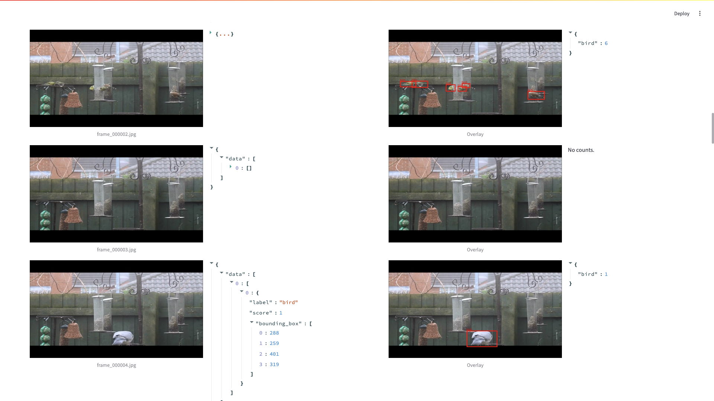
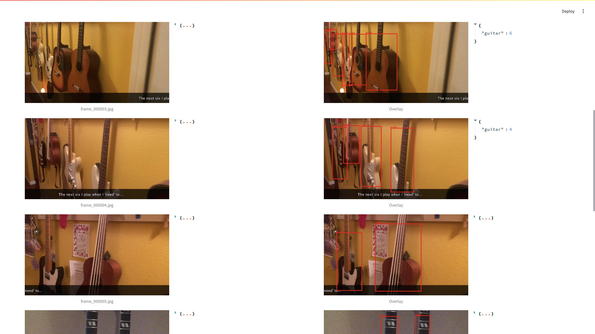

# Agentic Object Detection on YouTube Video Frames by LandingAI

This Streamlit application enables users to download YouTube videos, extract frames, run object detection using LandingAI’s Agentic Object Detection API, and visualize results—all in an interactive web interface.

---

## 📝 Features

- **Download & Extract Frames**: Fetch a YouTube video via `yt-dlp`, extract evenly spaced frames at a user-defined count and resolution.  
- **Agentic Object Detection**: Send frames to LandingAI’s Agentic API, save raw JSON responses, and display progress with a countdown timer.  
- **Interactive Visualization**:  
  - View raw frames alongside JSON detection output.  
  - Overlay bounding boxes and labels on frames.  
  - Display per-frame object counts.  
- **Summary Metrics**:  
  - Total objects detected across all frames.  
  - Percentage of frames containing at least one object.  
  - Average objects per frame (all vs non-zero).  
  - Bar chart of object counts per frame (powered by Altair).  
  - Downloadable CSV of frame-by-frame object counts.  

## 🚀 Installation

1. **Clone the repository**  
   ```bash
   git clone https://github.com/yourusername/agentic-yt-object-detection.git
   cd agentic-yt-object-detection

2. **Create a virtual environment** (recommended)  
   ```bash
   python3 -m venv venv
   source venv/bin/activate  # macOS/Linux
   venv\Scripts\activate     # Windows

3. **Install dependencies**
    ```bash
    pip install streamlit opencv-python pillow requests altair pandas yt-dlp
 
## ⚙️ Configuration

- **LandingAI API Key**  
  Provide your Base64-encoded LandingAI key in the `LandingLens API Key` field on **Tab 1** of the app.

- **Directory Settings**  
  You can customize the folder locations where files are stored:
  
  - `Video Save Directory`: Root folder where the downloaded YouTube video will be saved.  
  - `Frames Save Directory`: Folder to store the extracted frames from the video.  
  - `JSON Response Save Directory`: Folder to store the raw JSON output from the LandingAI Agentic API.

> **Note:** The app automatically creates subdirectories (`run1`, `run2`, etc.) for each new session when you click **Clear History and Reset**. This helps organize files from multiple detection runs.


## 🏃‍♂️ Usage

1. **Launch the app**  
   Run the Streamlit application from the command line:
   ```bash
   streamlit run app.py

---

### 2. Tab 1: Select Video

Use this tab to configure and kick off the pipeline:

- **YouTube Video URL**  
  Paste the URL of the YouTube video you want to analyze.

- **Prompt for Agentic Object Detection**  
  Enter a natural language prompt that describes the object(s) you want the model to detect (e.g., “Find all school buses”).

- **How many total frames to extract?**  
  Choose how many evenly spaced frames to extract from the video.

- **Frame Width (px)**  
  Set the desired frame width. Height is calculated using a 16:9 aspect ratio.

- **Video Save Directory**  
  Specify the folder where the YouTube video will be saved (e.g., `downloaded_video`).

- **Frames Save Directory**  
  Specify the folder to save the extracted frames (e.g., `frames`).

- **JSON Response Save Directory**  
  Specify the folder where the JSON responses from the API should be saved (e.g., `json_responses`).

- **LandingLens API Key**  
  Enter your Base64-encoded API key (secure input field).

- **API Throttling Delay (seconds)**  
  Set how many seconds to wait between sending frames to the API to avoid rate limits.

- **Run Object Detection after Frame Extraction**  
  Check this box to automatically run inference after the frames are saved.

Click the **Download & Extract Frames** button to begin the process. If detection is enabled, the app will immediately begin sending frames to the LandingAI Agentic API with progress updates and countdowns.

---

### 3. Tab 2: Frames and Objects

This tab displays your extracted frames alongside detection results:

- **Column 1: Raw Frame**  
  View the original frame image.

- **Column 2: JSON Response**  
  Review the raw API response for each frame (includes object labels and bounding boxes).

- **Column 3: Annotated Overlay**  
  See the same frame with bounding boxes and labels overlaid.

- **Column 4: Object Counts**  
  Shows a label-wise count of detected objects for each frame.

If you haven’t yet extracted frames or run detection, a helpful message will prompt you to go back to Tab 1.

---

### 4. Tab 3: Summary Metrics

This tab gives you an overview of model performance across all frames:

- **🧮 Total Objects**  
  Total number of objects detected in all frames.

- **📸 % Frames with Objects**  
  Percentage of frames that contained at least one detected object.

- **📊 Avg Objects (All Frames)**  
  Average number of objects per frame, including frames with zero detections.

- **📈 Avg Objects (Non-Zero Frames)**  
  Average number of objects per frame, considering only frames that had detections.

- **📉 Bar Chart**  
  An interactive Altair chart showing object counts per frame.

- **📥 Download CSV**  
  A download button for exporting the frame-by-frame object count summary as a CSV file named `object_counts_by_frame.csv`.

This summary helps you quickly understand detection density and frame coverage.


## Example outputs





## UI Inputs


## Demo video

[Watch the demo on YouTube](https://youtu.be/DwMVee_M2AA)
