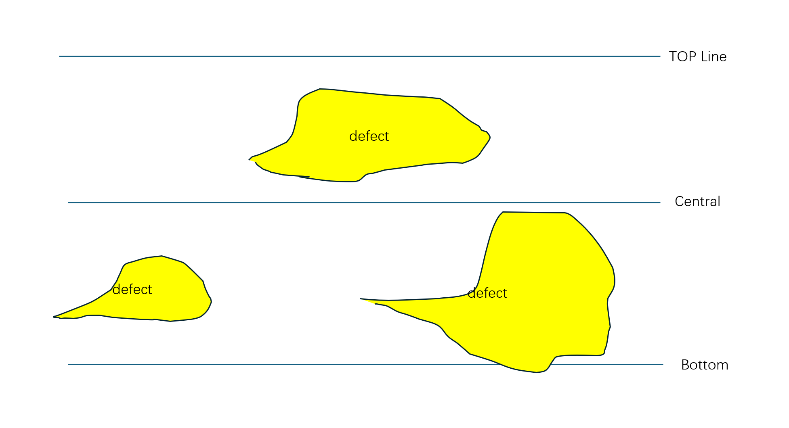

# Segmentation Post-Processing & Defect Measurement Analysis

## Overview
This script post-processes segmentation outputs from an image analysis task. It takes a JSON file containing segmentation predictions (encoded using Run-Length Encoding, or RLE) and its corresponding image, decodes the RLE masks, processes the edge lines to differentiate top and bottom segments, extracts defect areas labeled as "CHIPPING," measures the vertical distances from each defect to the detected edges, calculates the areas of different segmentation labels, and visualizes the processed results by overlaying the segmentation on the original image.

## Ouputs
1. For every defect instance, determines the vertical distance to its nearest edge (top or bottom).
2. Calculates areas for each segmentation label (by summing non-zero pixels in the masks).
3. Generates and saves an annotated image with a) Red points indicating the processed edges and b) Various shades of green illustrating defect areas.
4. Prints the computed distances and areas to the console.

## Example



## Features
- **RLE Decoding:** Converts RLE-encoded segmentation masks into binary NumPy arrays.
- **Edge Processing:** Extracts the "Edge" mask from the predictions, ensures a binary one-pixel width representation, and splits it into top and bottom regions based on a preset central line.
- **Defect Extraction:** Identifies and isolates individual defect regions (labeled "CHIPPING") using connected component analysis.
- **Distance Measurement:** Measures vertical distances from each defect instance to the corresponding top or bottom edge.
- **Area Calculation:** Computes the area (number of non-zero pixels) for each segmentation label.
- **Visualization:** Overlays processed edge lines (red) and defect instances (different shades of green) on the original image and saves the annotated output.
- **Debug Logging:** Provides detailed print statements for verifying intermediate processing steps such as encoding details and pixel counts.

## Prerequisites
- **Python Version:** 3.6 or later.
- **Python Libraries:**
  - `numpy`
  - `opencv-python` (`cv2`)
  - `Pillow` (PIL)
  - `json` (standard library)
  - `typing` (standard library)

Install the necessary libraries using pip:
```bash
pip install numpy opencv-python pillow

